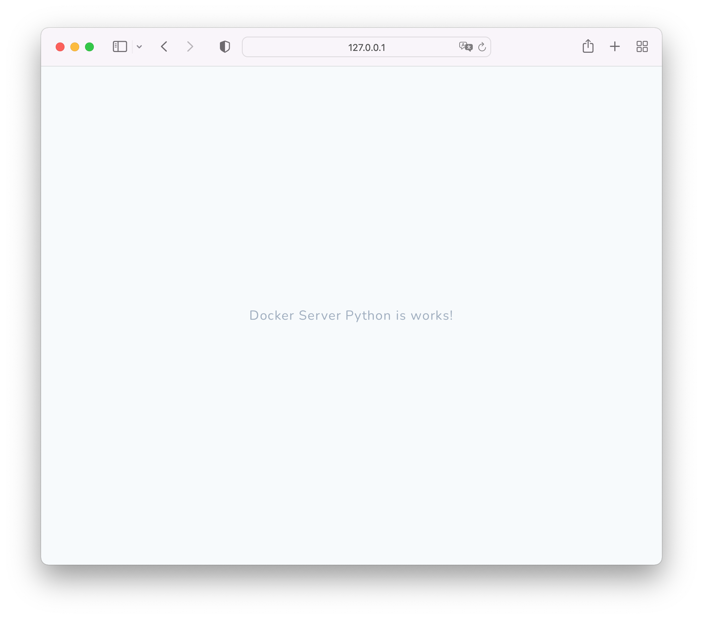

# docker-server-python

Before you start working with the server, you must install: **docker**, **ansible**, **make**.

After starting the server, it can be seen at `http://localhost:5000/`, display the contents of the file `./app/main.py`.

> To configure the server, you need to configure the file `./config.yml` and run the command `make start`.

## Characteristics

* python;
* flask.

## Server structure

* `ansible` - configuration files;
* `service` - connected services;
* `app` - server root folder.

## Useful links

* [localhost:5000](http://localhost:5000/).

## Control commands

* [Server](.docs/server/server.md);
* [Server settings](.docs/server/server-settings.md).
